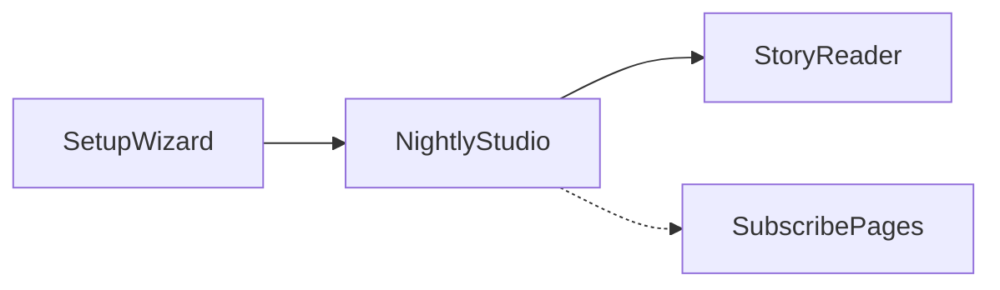

# MonoBedtime UX / UI audit

**Product:** MonoBedtime (Next.js).  
**Calibration (internal):** Guest-journey clarity, caregiver trust, readable hierarchy, calm motion suitable for bedtime—**family entertainment–grade** craft expectations.  
**Shipped language:** Neutral wording only; no third-party trademark names in this document or in product copy reviewed here.

---

## Methodology

1. **Local app:** `npm run dev` at `http://localhost:3000` or production parity via `npm run build && npm run start` (Playwright uses the latter when it starts the web server).
2. **Baseline screenshots:** Automated capture in Chromium (desktop) using `[e2e/ux-audit-screenshots.spec.ts](../e2e/ux-audit-screenshots.spec.ts)`. The spec mocks `[/api/ai-status](../app/api/ai-status/route.ts)`, `[/api/subscription/status](../app/api/subscription/status/route.ts)`, `[/api/generate-story](../app/api/generate-story/route.ts)`, and `[/api/generate-illustration](../app/api/generate-illustration/route.ts)` so flows run without live AI or Stripe. Output directory: `docs/ux-audit-screenshots/`.
3. **Regenerate artifacts:** From repo root:
  ```bash
   npx playwright test e2e/ux-audit-screenshots.spec.ts
  ```
   If browsers are missing: `npx playwright install chromium`.
4. **Heuristic review:** Code and component review of accessibility, motion, localization, and monetization messaging on the same surfaces.

**Evidence:** PNGs below (after running the command), plus static analysis. Update this doc after major UI changes and re-run the capture script.

---

## Journey mapping (core flows)


| #   | Flow                                                                             | Primary UI                                                                                                                                 |
| --- | -------------------------------------------------------------------------------- | ------------------------------------------------------------------------------------------------------------------------------------------ |
| 1   | First-run setup (name → age/language → companion spotlight)                      | `[components/setup-wizard.tsx](../components/setup-wizard.tsx)`                                                                            |
| 2   | Studio: prompt, service status, generate                                         | `[components/nightly-screen.tsx](../components/nightly-screen.tsx)`                                                                        |
| 3   | Reader: story body, scenes, gallery, new story                                   | `[components/story-book-reader.tsx](../components/story-book-reader.tsx)`                                                                  |
| 4   | Subscription messaging: checkout canceled; success unconfirmed (no `session_id`) | `[app/subscribe/cancel/page.tsx](../app/subscribe/cancel/page.tsx)`, `[app/subscribe/success/page.tsx](../app/subscribe/success/page.tsx)` |




---

## Screenshot index


| File                                   | Moment                                    |
| -------------------------------------- | ----------------------------------------- |
| `01-setup-step1-name.png`              | Setup step 1 — child name                 |
| `02-setup-step2-age-language.png`      | Setup step 2 — age and languages          |
| `03-setup-step3-companion.png`         | Setup step 3 — companion spotlight        |
| `04-studio-prompt.png`                 | Studio hero before generate               |
| `05-reader-story.png`                  | Reader with generated mock story          |
| `06-subscribe-cancel.png`              | `/subscribe/cancel`                       |
| `07-subscribe-success-unconfirmed.png` | `/subscribe/success` without `session_id` |


### Gallery (images appear after capture)

Setup step 1 — name

Setup step 2 — age and languages

Setup step 3 — companion

Studio — prompt surface

Reader — mock story

Subscribe — checkout canceled

Subscribe — success unconfirmed state

---

## Executive summary

- **Guest journey** is strong: setup → studio → reader follows a coherent “premiere night” narrative with consistent night-sky visual language.
- **Trust and clarity** around AI and illustration limits are mostly explicit; when billing is not configured, copy already avoids over-promising paid behavior—keep that honest tone as Stripe is wired up.
- **Companion asset:** `[setup-wizard.tsx](../components/setup-wizard.tsx)` and `[nightly-screen.tsx](../components/nightly-screen.tsx)` now reference `**/luffy.svg`**, matching `[public/luffy.svg](../public/luffy.svg)` (previously `**/luffy.png**` 404’d).
- **Accessibility gaps:** no project-wide `prefers-reduced-motion` handling; root `[app/layout.tsx](../app/layout.tsx)` uses `lang="en"` only while content can be Spanish/bilingual; glass controls need periodic focus/contrast checks.
- **Cognitive load:** studio and reader are rich; first-time caregivers may benefit from a short, dismissible “what happens next” primer before the first generate.
- **Motion:** Framer Motion is used heavily—good for delight, but vestibular-sensitive users need a reduced-motion path.
- **Monetization surfaces:** cancel and ambiguous success states are readable; main app badge copy should stay aligned with `billingConfigured` and real checkout availability.
- **Repeatability:** Screenshot baselines are reproducible via the Playwright spec above for PR review or periodic audits.

---

## Persona findings

Severity uses **P0** (ship blocker / trust or broken UI), **P1** (meaningful degradation), **P2** (polish). **Impact** is user-facing effect; **effort** is S/M/L; **risk** is regression or mis-implementation risk if ignored.

### TrustAndSafety (caregiver + child-adjacent)


| Check                           | Status  | Severity | Impact              | Effort | Risk | Notes                                                                               |
| ------------------------------- | ------- | -------- | ------------------- | ------ | ---- | ----------------------------------------------------------------------------------- |
| Tone avoids fear/shame          | Pass    | —        | —                   | —      | —    | Calm setup and limits messaging.                                                    |
| AI failure / fallback explained | Partial | P1       | Confusion on errors | M      | M    | Service status exists; verify live errors always map to reassuring copy + recovery. |
| Data transparency               | Partial | P2       | Trust               | S      | L    | Local profile in `localStorage`; optional one-liner on what stays on device.        |
| Companion imagery loads         | Pass    | —        | —                   | —      | —    | SVG path fixed; confirm in `03-setup-step3-companion.png` after capture.            |


**Recommendations:** Add a factual privacy one-liner (if accurate) or link. Standardize post-error CTA: retry + connectivity hint.

### StoryNarrativeUX (guest journey)


| Check                            | Status  | Severity | Impact                | Effort | Risk | Notes                                           |
| -------------------------------- | ------- | -------- | --------------------- | ------ | ---- | ----------------------------------------------- |
| Setup progress                   | Pass    | —        | —                     | —      | —    | Steps 1–3 + progress chip.                      |
| Orientation after setup          | Pass    | —        | —                     | —      | —    | Clear hero toward prompt + generate.            |
| Reader wayfinding                | Pass    | —        | —                     | —      | —    | Dots, gallery, swipe, keyboard hints in reader. |
| “What’s next” before first story | Partial | P1       | Drop-off / hesitation | S      | L    | Short primer above textarea (first run only).   |


**Recommendations:** Dismissible “How tonight works” card stored in `localStorage`.

### VisualSystem


| Check                    | Status  | Severity | Impact      | Effort | Risk | Notes                                                       |
| ------------------------ | ------- | -------- | ----------- | ------ | ---- | ----------------------------------------------------------- |
| Cohesive palette         | Pass    | —        | —           | —      | —    | Navy, indigo, warm accent, glass.                           |
| Typography hierarchy     | Pass    | —        | —           | —      | —    | Display + body scale reads “bedtime premium.”               |
| Density on small screens | Partial | P2       | Readability | M      | M    | Validate long stories on narrow viewports (e.g. iPhone SE). |


**Recommendations:** Breakpoint QA checklist or visual snapshot strategy for key widths.

### MotionAndDelight


| Check             | Status | Severity | Impact            | Effort | Risk | Notes                                                   |
| ----------------- | ------ | -------- | ----------------- | ------ | ---- | ------------------------------------------------------- |
| Purposeful motion | Pass   | —        | —                 | —      | —    | Transitions and menus support the story.                |
| Reduced motion    | Fail   | P1       | Vestibular / a11y | M      | L    | No `prefers-reduced-motion` usage found in repo search. |
| Loading feedback  | Pass   | —        | —                 | —      | —    | Generate and illustration loading states present.       |


**Recommendations:** CSS or Framer `useReducedMotion` to shorten or disable non-essential motion.

### Accessibility


| Check              | Status  | Severity | Impact              | Effort | Risk | Notes                                                       |
| ------------------ | ------- | -------- | ------------------- | ------ | ---- | ----------------------------------------------------------- |
| Focus and keyboard | Partial | P1       | Keyboard / AT users | M      | M    | Many controls; verify visible focus on `.glass-button`.     |
| Labels             | Partial | P1       | Screen readers      | S–M    | M    | Prompt has `aria-label`; re-check setup field associations. |
| Document language  | Partial | P1       | AT + SEO            | S–M    | M    | `lang="en"` fixed; profile can be ES/bilingual.             |
| Touch targets      | Partial | P2       | Mobile taps         | S      | M    | Icon buttons ~48px; verify spacing.                         |


**Recommendations:** Derive `lang` from profile language when possible.

### Localization


| Check            | Status  | Severity | Impact   | Effort | Risk | Notes                              |
| ---------------- | ------- | -------- | -------- | ------ | ---- | ---------------------------------- |
| Bilingual intent | Pass    | —        | —        | —      | —    | Language modes and mixed API copy. |
| UI consistency   | Partial | P2       | ES users | L      | M    | Setup strings skew English-first.  |


**Recommendations:** Centralize strings or minimal i18n map for setup + critical errors.

### MonetizationClarity


| Check        | Status  | Severity | Impact | Effort | Risk | Notes                                                          |
| ------------ | ------- | -------- | ------ | ------ | ---- | -------------------------------------------------------------- |
| Free vs paid | Pass    | —        | —      | —      | —    | Badge explains remaining illustrations.                        |
| Dead ends    | Partial | P1       | Trust  | S      | M    | When checkout unavailable, avoid “buy”-like sparkle elsewhere. |


**Recommendations:** Tie celebratory CTAs to `billingConfigured` and real `canCheckout`.

---

## Prioritized backlog

### P0 — Do now


| Item                                                  | Impact           | Effort | Owner hint                                                                                                             |
| ----------------------------------------------------- | ---------------- | ------ | ---------------------------------------------------------------------------------------------------------------------- |
| ~~Fix companion image (`/luffy.png` → `/luffy.svg`)~~ | Broken spotlight | S      | Done in `[setup-wizard.tsx](../components/setup-wizard.tsx)`, `[nightly-screen.tsx](../components/nightly-screen.tsx)` |


*No other P0 items from this audit pass.*

### P1 — Next sprint


| Item                                            | Impact              | Effort |
| ----------------------------------------------- | ------------------- | ------ |
| `prefers-reduced-motion` support                | Inclusion / comfort | M      |
| Dynamic or accurate `html lang`                 | a11y + SEO          | S–M    |
| First-run “how it works” dismissible            | Comprehension       | S      |
| Live error copy + recovery for generate         | Trust               | M      |
| Monetization CTA honesty vs `billingConfigured` | Trust               | S      |


### P2 — Backlog


| Item                                | Impact     | Effort |
| ----------------------------------- | ---------- | ------ |
| Privacy one-liner for local profile | Trust      | S      |
| i18n pass for setup + errors        | Market fit | L      |
| Narrow-screen / long-story QA       | Polish     | M      |


---

## Quick wins (≤ 1 day)

- Run `npx playwright test e2e/ux-audit-screenshots.spec.ts` and commit PNGs if you want the gallery filled in-repo.
- Add reduced-motion CSS guardrails.
- Extend `data-testid` coverage where manual QA is still heavy.

## Strategic bets

- Lightweight i18n for ES/EN/bilingual parity.
- Reader “lights out” mode: dimmer chrome, less motion.

---

## Re-audit checklist (after changes)

- `npx playwright test e2e/ux-audit-screenshots.spec.ts` — all PNGs refresh without flaky waits.
- Setup: companion image loads; step 3 completes; no console 404s for assets.
- Studio: generate path (live or mocked); error state copy is reassuring if API fails.
- Reader: keyboard arrows, swipe, gallery; quick screen-reader pass on title and body.
- OS “reduce motion”: animations dampen or respect preference.
- Spanish/bilingual profile: `lang` and critical strings spot-check.
- Subscribe pages: cancel + success edge states still match product truth.

---

## File touchpoints (for implementers)


| Area                  | Files                                                                                                                        |
| --------------------- | ---------------------------------------------------------------------------------------------------------------------------- |
| Setup                 | `[components/setup-wizard.tsx](../components/setup-wizard.tsx)`                                                              |
| Studio                | `[components/nightly-screen.tsx](../components/nightly-screen.tsx)`                                                          |
| Reader                | `[components/story-book-reader.tsx](../components/story-book-reader.tsx)`                                                    |
| Chrome / menu         | `[components/glass-menu.tsx](../components/glass-menu.tsx)`                                                                  |
| Posters               | `[components/scene-poster.tsx](../components/scene-poster.tsx)`                                                              |
| Shell                 | `[app/layout.tsx](../app/layout.tsx)`, `[app/globals.css](../app/globals.css)`                                               |
| Screenshot automation | `[e2e/ux-audit-screenshots.spec.ts](../e2e/ux-audit-screenshots.spec.ts)`, `[playwright.config.ts](../playwright.config.ts)` |
